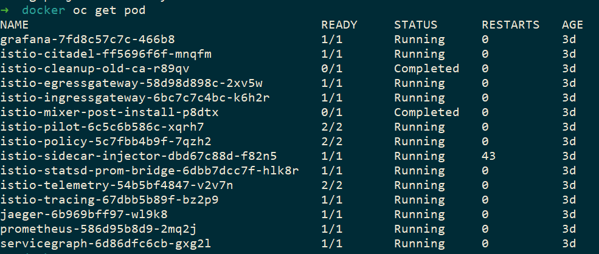
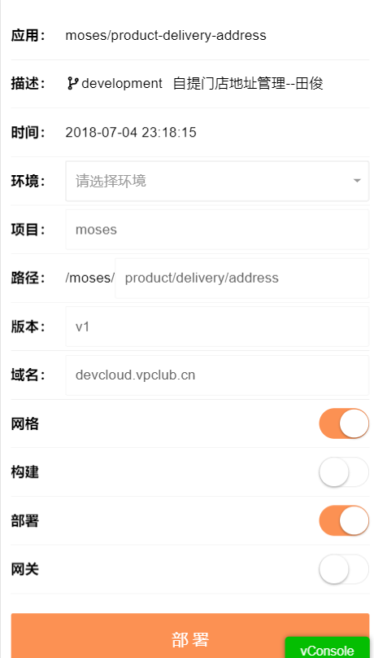
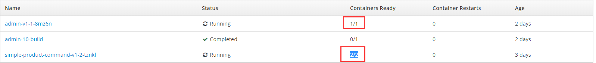
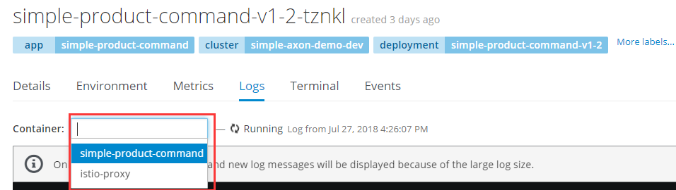
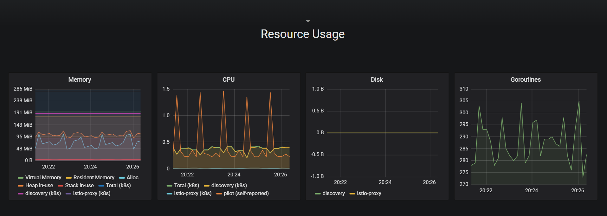
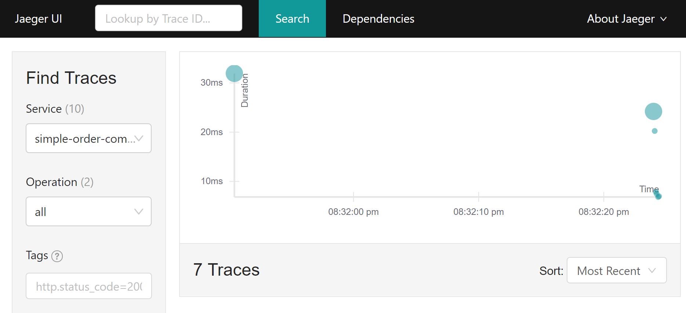
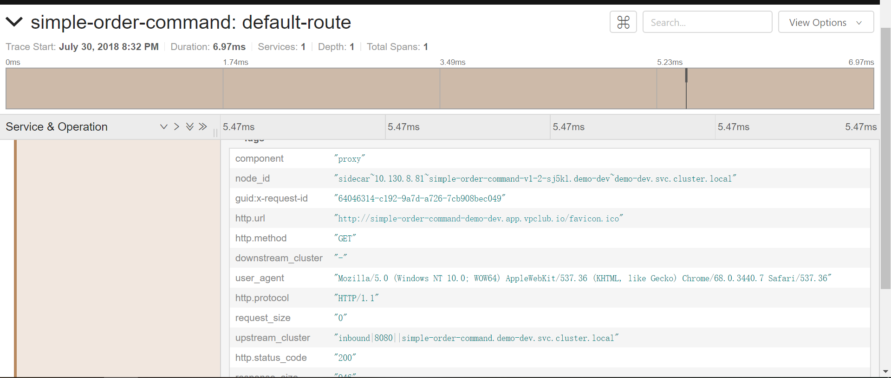
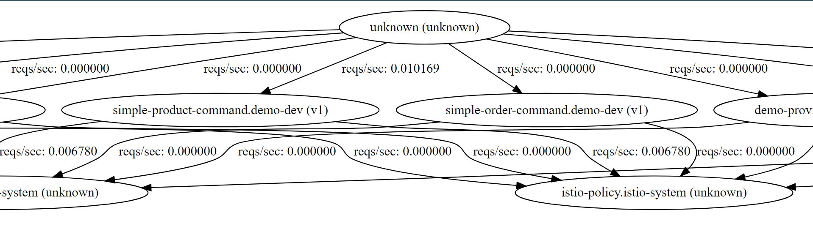

# OpenShift 集成 Istio 服务网格

## Istio 概述

* `istio有什么特性`

 在从单体应用程序向分布式微服务架构的转型过程中，开发人员和运维人员面临诸多挑战，使用Istio可以解决这些问题。术语服务网格（Service Mesh）通常用于描述构成这些应用程序的微服务网络以及它们之间的交互。随着规模和复杂性的增长，服务网格越来越难以理解和管理。它的需求包括服务发现、负载均衡、故障恢复、指标收集和监控以及通常更加复杂的运维需求，例如A/B测试、金丝雀发布、限流、访问控制和端到端认证等。

Istio提供了一个完整的解决方案，通过为整个服务网格提供行为洞察和操作控制来满足微服务应用程序的多样化需求。它在服务网络中统一提供了许多关键功能：

* 流量管理。控制服务之间的流量和API调用的流向，使得调用更可靠，并使网络在恶劣情况下更加健壮。

* 可观察性。了解服务之间的依赖关系，以及它们之间流量的本质和流向，从而提供快速识别问题的能力。

* 策略执行。将组织策略应用于服务之间的互动，确保访问*策略得以执行，资源在消费者之间良好分配。策略的更改是通过配置网格而不是修改应用程序代码。

* 服务身份和安全。为网格中的服务提供可验证身份，并提供保护服务流量的能力，使其可以在不同可信度的网络上流转。

除此之外，Istio针对可扩展性进行了设计，以满足不同的部署需要：

* 平台支持。Istio旨在可以在各种环境中运行，包括跨云、预置环境、Kubernetes、Mesos等。最初专注于Kubernetes，但很快将支持其他环境。
* 集成和定制。策略执行组件可以扩展和定制，以便与现有的ACL、日志、监控、配额、审核等解决方案集成。

这些功能极大的减少了应用程序代码，底层平台和策略之间的耦合。耦合的减少不仅使服务更容易实现，而且还使运维人员更容易地在环境之间移动应用程序部署，或换用新的策略方案。因此，结果就是应用程序从本质上变得更容易移动。

## Istio 安装

在这里istio和openshift我使用的版本是：

```txt
istio     0.8.0
openshift v3.9.0
```

官网提供了很多种安装istio的方法，但是最方便的、最快捷的方式就只有ansible的方式安装了，我这里提供了两种安装Istio,如果你想使用别的方式安装istio,则进入istio官网:https://istio.io/docs/ 。

### 使用ansible安装istio

    在使用ansible安装openshift之前，首先需要安装ansible，在这里我提供了ansible的安装方式，如下：

    Ansible是用Python开发的，使用ansible需要操作系统有Python，建议Python版本2.6以上。

    (1) python2.7安装

    ```bash
    # 下载源码包
    wget https://www.python.org/ftp/python/2.7.8/Python-2.7.8.tgz

    #解压
    tar xvzf Python-2.7.8.tgz

    cd Python-2.7.8

    ./configure --prefix=/usr/local

    #安装
    make

    make install
    ```

    (2) setuptools模块安装

    ```bash
    wget https://pypi.python.org/packages/source/s/setuptools/setuptools-7.0.tar.gz

    tar xvzf setuptools-7.0.tar.gz

    cd setuptools-7.0

    python setup.py install
    ```

    安装好setuptools后就可以利用easy_install这个工具安装下面的python模块了，但我的电脑是虚拟机，配置太低了，所以基本无法安装，所以只好一个一个下载下来再安装了。

    (3) pycrypto模块安装

    ```bash
    wget https://pypi.python.org/packages/source/p/pycrypto/pycrypto-2.6.1.tar.gz

    tar xvzf pycrypto-2.6.1.tar.gz

    cd pycrypto-2.6.1

    python setup.py install
    ```

    (4) PyYAML模块安装

    ```bash
    wget http://pyyaml.org/download/libyaml/yaml-0.1.5.tar.gz

    tar xvzf yaml-0.1.5.tar.gz

    cd yaml-0.1.5

    ./configure --prefix=/usr/local

    make --jobs=`grep processor/proc/cpuinfo | wc -l`

    make install

    wget https://pypi.python.org/packages/source/P/PyYAML/PyYAML-3.11.tar.gz

    tar xvzf PyYAML-3.11.tar.gz

    cd PyYAML-3.11

    python setup.py install
    ```

    (5) Jinja2模块安装

    ```bash
    wget https://pypi.python.org/packages/source/M/MarkupSafe/MarkupSafe-0.9.3.tar.gz

    tar xvzf MarkupSafe-0.9.3.tar.gz

    cd MarkupSafe-0.9.3

    python setup.py install

    wget https://pypi.python.org/packages/source/J/Jinja2/Jinja2-2.7.3.tar.gz

    tar xvzf Jinja2-2.7.3.tar.gz

    cd Jinja2-2.7.3

    python setup.py install
    ```

    (6) paramiko模块安装

    ```bash
    wget https://pypi.python.org/packages/source/e/ecdsa/ecdsa-0.11.tar.gz

    tar xvzf ecdsa-0.11.tar.gz

    cd ecdsa-0.11

    python setup.py install

    wget https://pypi.python.org/packages/source/p/paramiko/paramiko-1.15.1.tar.gz

    tar xvzf paramiko-1.15.1.tar.gz

    cd paramiko-1.15.1

    python setup.py install
    ```

    (7) simplejson模块安装

    ```bash

    wget https://pypi.python.org/packages/source/s/simplejson/simplejson-3.6.5.tar.gz

    tar xvzf simplejson-3.6.5.tar.gz

    cd simplejson-3.6.5

    python setup.py install
    ```

    (8) ansible安装

    ```bash
    wget https://github.com/ansible/ansible/archive/v1.7.2.tar.gz

    tar xvzf ansible-1.7.2.tar.gz

    cd ansible-1.7.2

    python setup.py install
    ```

    ansible 安装成功后我们就可以安装istio了，如下：

    ```bash
    ansible-playbook main.yml
    ```

    安装好后openshift就多出来一个分组istio-system

    ```bash
    oc get pod -n istio-system

    ```

    如图：

    

### 使用源码安装istio

    ```bash
    wget https://github.com/istio/istio/releases/download/0.8.0/istio-0.8.0-linux.tar.gz

    tar -zxvf  istio-0.8.0-linux.tar.gz

    cd istio-0.8.0/install/kubernetes/

    oc create -f istio.yaml
    ```

## Istio 注入到pod中

如果需要在服务中注入sidecar，则我们在部署工具的时候选择`网格`，如下图：



如果你部署的项目是第一次部署则需要加上`构建`和`网关` 。

这个时候我们就可以看到我们项目中的pod发生了一些变化。

在我们部署的pod中可以看到`Containers Ready` 2/2 这个时候我们就可以发现多了一个pod，看到这个就可以证明我们在项目中已经注入istio。如下：



还有一处不同的是在查看logs的时候多了一处Container 而另外一个pod是`istio-proxy`的logs。



部署成功后pod启动成功后，

```bash
# 请求接口
curl -I http://simple-order-command-demo-dev.app.vpclub.io 
```

在istio-system就可以看到注入的效果了。

## istio 组件的作用

在这里istio有很多的组件可以查看你所有pod的各个指标。它包含的组件有 `egressgateway`、 `grafana`、 `ingressgateway`、 `istio-pilot`、 `istio-tracing`、 `jaeger`、 `prometheus`、 `security`、 `servicegraph`、 `sidecarInjectorWebhook`。

### grafana

    grafana主要的作用是监控到服务器的cpu 、内存、硬盘的各项指标。

    

### jaeger

    jaeger 可以查看服务的调用情况调用时长。

    

    

### servicegraph

各个组件可以清楚的知道服务之间的调用关系. servicegraph的router/dotviz, 或者是router/force/forcegraph.html

例如：

```browser
   http://servicegraph-istio-system.app.vpclub.io/force/forcegraph.html,
```

```browser
   http://servicegraph-istio-system.app.vpclub.io/dotviz
```

